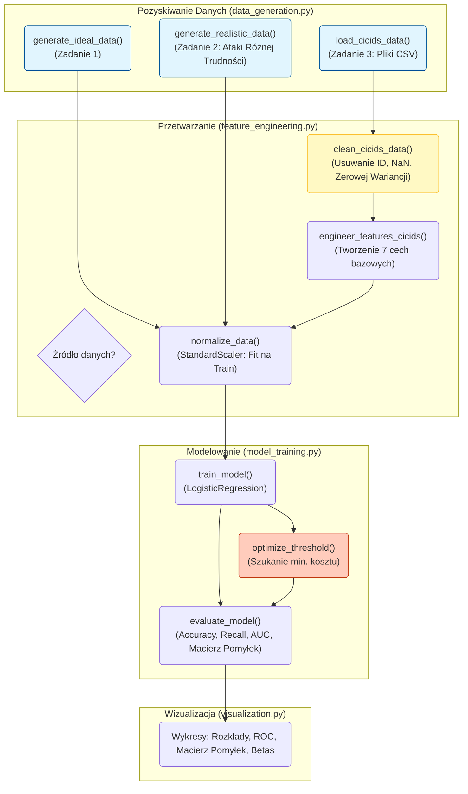
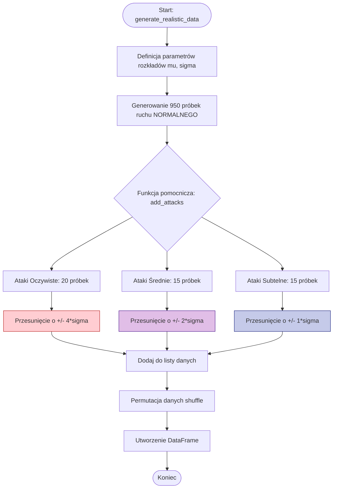
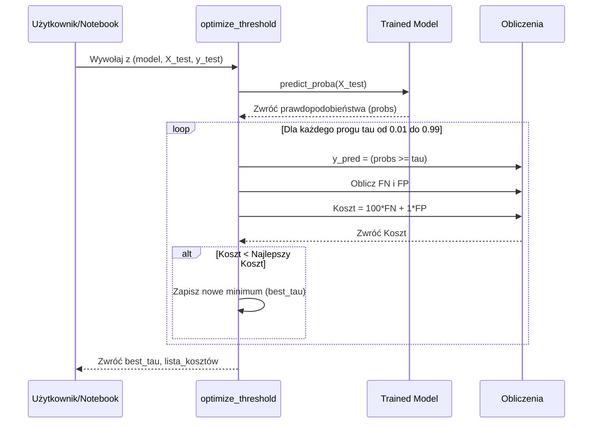
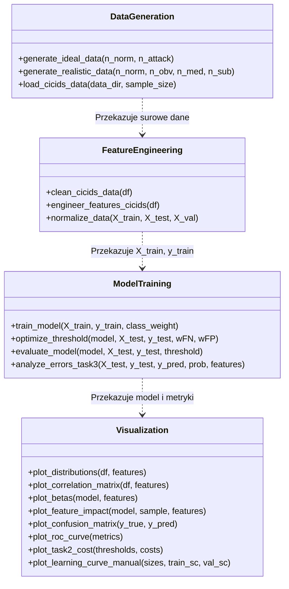

# Uczenie Maszynowe w Bezpieczeństwie
## Projekt 2
### Grupa 22B
### Autorzy: Przemysław Kałużiński, Jakub Kuśmierczyk, Michał Kaczor

### Oznaczenia matematyczne

* **$\mathcal{N}(\mu, \sigma)$** – rozkład normalny o średniej $\mu$ i odchyleniu standardowym $\sigma$
* **$Poisson(\lambda)$** – rozkład Poissona o parametrze $\lambda$
* **$Exp(\lambda)$** – rozkład wykładniczy o parametrze $\lambda$
* **TP, TN, FP, FN** – prawdziwie dodatnie, prawdziwie ujemne, fałszywie dodatnie, fałszywie ujemne
* **$\beta$** – współczynnik regresji logistycznej
* **$\beta_0$** – wyraz wolny
* **$\tau$** – próg decyzyjny
* **$H$** – entropia Shannona
* **$\rho$** – współczynnik korelacji Pearsona
* **$X$** – macierz cech (dane wejściowe)
* **$y$** – wektor etykiet ($0$ – normalny ruch, $1$ – atak)
* **$n$** – liczba próbek
* **$d$** – liczba cech
* **$\hat{\mu}$** – estymator średniej
* **$\hat{\sigma}$** – estymator odchylenia standardowego
* **$\epsilon$** – mała stała numeryczna zapobiegająca dzieleniu przez zero (typowo $10^{-10}$)
* **$D$** – ramka danych (dataframe)
* **$D_{Label}$** – kolumna etykiet w ramce danych
* **$D_{DestPort}$** – kolumna portów docelowych w ramce danych
* **$L$** – wektor etykiet (tekstowych lub numerycznych)
* **$L_{norm}$** – etykieta klasy normalnej (wartość oznaczająca normalny ruch)
* **$T_{type}$** – kolumna typu ataku w ramce danych
* **$T_{DDoS}$** – wartość etykiety oznaczająca atak DDoS
* **$T_{Port}$** – wartość etykiety oznaczająca atak Port Scan

### Notacja funkcji w algorytmach

* **$\mathbb{E}[X]$** – wartość oczekiwana (średnia) wektora $X$
* **$\sigma[X]$** – odchylenie standardowe wektora $X$
* **$Var[X]$** – wariancja wektora $X$
* **$Med[X]$** – mediana wektora $X$
* **$\oplus$** – konkatenacja (łączenie) struktur danych
* **$\pi$** – permutacja losowa elementów
* **$\pi(X, y)$** – aplikacja permutacji losowej do danych $X$ i etykiet $y$
* **$sort(X, key)$** – sortowanie zbioru $X$ według klucza
* **$argsort(X)$** – zwraca indeksy sortujące wektor $X$ rosnąco
* **$clip(x, a, b)$** – obcięcie wartości $x$ do przedziału $[a, b]$
* **$⊮(\cdot)$** – funkcja wskaźnikowa (1 gdy warunek prawdziwy, 0 w przeciwnym przypadku)
* **$\triangleright$** – symbol komentarza w algorytmach
* **$M(y, \hat{y})$** – macierz pomyłek zwracająca (TP, TN, FP, FN) dla etykiet $y$ i predykcji $\hat{y}$
* **$H(\{p_i\})$** – entropia Shannona: $H = - \sum_i p_i \log_2(p_i)$
* **$\arg \min_x f(x)$** i **$\arg \max_x f(x)$** – argument minimalizujący/maksymalizujący funkcję $f$
* **$x^*$** – notacja oznaczająca wartość optymalną (po optymalizacji)
* **$0_{n \times m}$** – macierz zer o wymiarach $n \times m$
* **$0_n$** – wektor zer o długości $n$
* **unique(S)** – zwraca zbiór unikalnych elementów ze zbioru $S$
* **read_csv(f)** – wczytuje dane z pliku CSV o ścieżce $f$
* **is_numeric(X)** – predykat zwracający prawdę gdy $X$ jest typu numerycznego
* **num_cols(D)** – zwraca liczbę kolumn w macierzy/ramce danych $D$
* **sample(S, k)** – zwraca losowy podzbiór $k$ elementów ze zbioru $S$
* **stratified_split(X, y, p)** – podział ze stratyfikacją w proporcji $p : (1 - p)$
* **$|$** – separator w definicjach matematycznych (odpowiednik "gdzie")

### Operatory algorytmiczne

* **$\leftarrow$** – operator przypisania (strzałka w lewo): przypisanie wartości do zmiennej
* **$\sim$** – operator losowania: $x \sim \mathcal{N}(\mu, \sigma)$ oznacza wylosowanie wartości $x$ z rozkładu normalnego
* **$\wedge$** – koniunkcja logiczna (AND): $a \wedge b$ jest prawdziwe gdy oba warunki są spełnione
* **$\vee$** – alternatywa logiczna (OR): $a \vee b$ jest prawdziwe gdy przynajmniej jeden warunek jest spełniony
* **$\setminus$** – różnica zbiorów: $A \setminus B$ zawiera elementy z $A$ nieobecne w $B$
* **$\in$** – przynależność do zbioru: $x \in S$ oznacza, że element $x$ należy do zbioru $S$
* **$\exists$** – kwantyfikator egzystencjalny: istnieje
* **$\forall$** – kwantyfikator uniwersalny: dla każdego

### Implementacja projektu
**Plik data_generation.py**

Plik ten odpowiada za generowanie danych syntetycznych dla Zadania 1 i Zadania 2 oraz wczytywanie danych rzeczywistych dla Zadania 3. Implementuje logikę opisaną w Algorytmach 1 i 2 z dokumentacji projektu.

**Zmienne globalne i importy**
- Importowane są biblioteki `numpy`, `pandas` oraz `os`.
- Kod korzysta z generatora liczb losowych `numpy`, co pozwala na reprodukowalność wyników dzięki ustawieniu ziarna losowości (`seed`).

**Kod:**
```python
import numpy as np
import pandas as pd
import os
```

**1. Funkcja `generate_ideal_data`**

**Wejście:**
- `n_norm` (int, domyślnie 800) – liczba próbek klasy normalnej.
- `n_attack` (int, domyślnie 200) – liczba próbek klasy ataku.
- `seed` (int, domyślnie 42) – ziarno losowości dla powtarzalności wyników.

**Wyjście:**
- `df` (pandas.DataFrame) – ramka danych zawierająca wygenerowane cechy oraz etykietę `Target`.
- `feature_names` (list) – lista nazw 7 wygenerowanych cech.

**Opis:**

Funkcja realizuje **Algorytm 1** (Zadanie 1: Eksperyment z danymi idealnymi). Generuje syntetyczny zbiór danych, gdzie klasa normalna i ataki są wyraźnie odseparowane.
- Dla ruchu normalnego losuje wartości z rozkładów (Normalny, Poisson, Wykładniczy) o parametrach określonych w treści zadania (np. pakiety/s: średnia=50, odchylenie=15).
- Dla ataków używa przesuniętych parametrów (np. pakiety/s: średnia=250, odchylenie=30).
- Łączy dane w jeden zbiór, dodaje etykiety (0 – normalny, 1 – atak) i dokonuje permutacji (wymieszania) próbek.

**Kod:**
```python
def generate_ideal_data(n_norm=800, n_attack=200, seed=42):
    np.random.seed(seed)
    
    # Parametry (zgodne z treścią zadania)
    X_norm = np.zeros((n_norm, 7))
    X_norm[:, 0] = np.random.normal(50, 15, n_norm)              # Pakiety/s
    X_norm[:, 1] = np.random.normal(800, 200, n_norm)            # Rozmiar
    X_norm[:, 2] = np.random.normal(2.5, 0.5, n_norm)            # Entropia
    X_norm[:, 3] = np.clip(np.random.normal(0.2, 0.05, n_norm), 0, 1) # SYN
    X_norm[:, 4] = np.random.poisson(5, n_norm) + 1              # IP
    X_norm[:, 5] = np.random.exponential(30, n_norm)             # Czas
    X_norm[:, 6] = np.random.poisson(2, n_norm)                  # Powtórzenia
    y_norm = np.zeros(n_norm)

    X_attack = np.zeros((n_attack, 7))
    X_attack[:, 0] = np.random.normal(250, 30, n_attack)
    X_attack[:, 1] = np.random.normal(300, 100, n_attack)
    X_attack[:, 2] = np.random.normal(4.0, 0.3, n_attack)
    X_attack[:, 3] = np.clip(np.random.normal(0.8, 0.05, n_attack), 0, 1)
    X_attack[:, 4] = np.random.poisson(50, n_attack) + 1
    X_attack[:, 5] = np.random.exponential(2, n_attack)
    X_attack[:, 6] = np.random.poisson(20, n_attack)
    y_attack = np.ones(n_attack)

    feature_names = ['packetspersec', 'avgpacketsize', 'portentropy', 'synratio', 'uniquedstips', 'connectionduration', 'repeatedconnections']
    
    X = np.vstack([X_norm, X_attack])
    y = np.hstack([y_norm, y_attack])
    
    df = pd.DataFrame(X, columns=feature_names)
    df['Target'] = y
    
    # Mieszanie (permutacja)
    df = df.sample(frac=1, random_state=seed).reset_index(drop=True)
    return df, feature_names
```

**2. Funkcja `generate_realistic_data`**

**Wejście:**
- `n_norm` (int, domyślnie 950) – liczba próbek klasy normalnej.
- `n_obv` (int, domyślnie 20) – liczba ataków oczywistych.
- `n_med` (int, domyślnie 15) – liczba ataków średnio subtelnych.
- `n_sub` (int, domyślnie 15) – liczba ataków bardzo subtelnych.
- `seed` (int, domyślnie 42) – ziarno losowości.

**Wyjście:**
- `df` (pandas.DataFrame) – ramka danych z cechami, etykietą `Target` oraz typem ataku `Type`.
- `feature_names` (list) – lista nazw cech.

**Opis:**

Funkcja realizuje **Algorytm 2** (Zadanie 2: Eksperyment z danymi realistycznymi). Tworzy silnie niezbalansowany zbiór danych (proporcja 950:50) symulujący rzeczywiste warunki sieciowe.
- Normalny ruch generowany jest jak w Zadaniu 1.
- Ataki są generowane w trzech kategoriach trudności, poprzez przesunięcie średniej rozkładu normalnego ruchu o wielokrotność odchylenia standardowego (k*sigma):
    - Ataki oczywiste: przesunięcie o 4 odchylenia standardowe.
    - Ataki średnie: przesunięcie o 2 odchylenia standardowe.
    - Ataki subtelne: przesunięcie o 1 odchylenie standardowe.
- Funkcja pomocnicza `add_attacks` obsługuje logikę przesunięć w zależności od tego, czy cecha rośnie, czy maleje podczas ataku.

**Kod:**
```python
def generate_realistic_data(n_norm=950, n_obv=20, n_med=15, n_sub=15, seed=42):
    np.random.seed(seed)
    
    mu_norm = np.array([50, 800, 2.5, 0.2, 5, 30, 2])
    sigma_norm = np.array([15, 200, 0.5, 0.05, 0, 0, 0]) 
    
    feature_names = ['packetspersec', 'avgpacketsize', 'portentropy', 'synratio', 'uniquedstips', 'connectionduration', 'repeatedconnections']
    data_list = []

    # 1. Normalny
    for _ in range(n_norm):
        row = [
            np.random.normal(mu_norm[0], sigma_norm[0]),
            np.random.normal(mu_norm[1], sigma_norm[1]),
            np.random.normal(mu_norm[2], sigma_norm[2]),
            np.clip(np.random.normal(mu_norm[3], sigma_norm[3]), 0, 1),
            np.random.poisson(mu_norm[4]) + 1,
            np.random.exponential(mu_norm[5]),
            np.random.poisson(mu_norm[6])
        ]
        data_list.append(row + [0, 'Normal'])
            
    # Helper dla ataków
    def add_attacks(n, k, type_name):
        for _ in range(n):
            row = [
                np.random.normal(mu_norm[0] + k*sigma_norm[0], sigma_norm[0]),
                np.random.normal(mu_norm[1] - k*sigma_norm[1], sigma_norm[1]),
                np.random.normal(mu_norm[2] + k*sigma_norm[2], sigma_norm[2]),
                np.clip(np.random.normal(mu_norm[3] + k*sigma_norm[3], sigma_norm[3]), 0, 1),
                np.random.poisson(mu_norm[4] + k*10) + 1,
                np.random.exponential(mu_norm[5] / k),
                np.random.poisson(mu_norm[6] + k*5)
            ]
            data_list.append(row + [1, type_name])

    add_attacks(n_obv, 4, 'Obvious')
    add_attacks(n_med, 2, 'Medium')
    add_attacks(n_sub, 1, 'Subtle')
    
    df = pd.DataFrame(data_list, columns=feature_names + ['Target', 'Type'])
    df = df.sample(frac=1, random_state=seed).reset_index(drop=True)
    return df, feature_names
```

**3. Funkcja `load_cicids_data`**

**Wejście:**
- `data_dir` (str) – ścieżka do katalogu z plikami CSV (CICIDS2017).
- `sample_size` (int, domyślnie 50000) – liczba próbek pobieranych z każdego pliku (dla wydajności).
- `seed` (int, domyślnie 42) – ziarno losowości.

**Wyjście:**
- `full_df` (pandas.DataFrame) – połączona i wylosowana próbka danych rzeczywistych.

**Opis:**

Funkcja obsługuje wczytywanie danych rzeczywistych wymaganych w **Zadaniu 3**.
- Definiuje mapowanie plików dla ruchu normalnego (`Monday`), ataków DDoS (`Friday-DDoS`) i PortScan (`Friday-PortScan`).
- Wczytuje pliki CSV, usuwa zbędne spacje z nazw kolumn.
- Wykonuje losowe próbkowanie (`sample`), aby zmniejszyć rozmiar danych do poziomu umożliwiającego szybkie obliczenia, co jest zgodne z zaleceniami optymalizacji wydajności.
- Łączy dane w jedną ramkę (`pd.concat`).

**Kod:**
```python
def load_cicids_data(data_dir, sample_size=50000, seed=42):

    files = {
        'normal': 'Monday-WorkingHours.pcap_ISCX.csv',
        'ddos': 'Friday-WorkingHours-Afternoon-DDoS.pcap_ISCX.csv',
        'portscan': 'Friday-WorkingHours-Afternoon-PortScan.pcap_ISCX.csv'
    }
    
    dfs = []
    for k, fname in files.items():
        path = os.path.join(data_dir, fname)
        if os.path.exists(path):
            print(f"Wczytywanie: {fname}")
            try:
                temp_df = pd.read_csv(path)
                temp_df.columns = temp_df.columns.str.strip() # Usuwanie spacji z nazw kolumn
                # Sampling dla wydajności
                if len(temp_df) > sample_size:
                    temp_df = temp_df.sample(n=sample_size, random_state=seed)
                dfs.append(temp_df)
            except Exception as e:
                print(f"Błąd wczytywania {fname}: {e}")
        else:
            print(f"Ostrzeżenie: Plik {path} nie istnieje.")
            
    if not dfs:
        raise FileNotFoundError("Nie znaleziono plików danych.")
        
    full_df = pd.concat(dfs, ignore_index=True)
    return full_df.sample(frac=1, random_state=seed).reset_index(drop=True)
```

---

**Plik feature_engineering.py**

Ten plik zawiera funkcje odpowiedzialne za czyszczenie, transformację i normalizację danych rzeczywistych (CICIDS2017), realizując wytyczne z Algorytmów 5 i 6.

**Zmienne globalne i importy**
Podobnie jak wcześniej, importowane są biblioteki `numpy` oraz `pandas`. Dodatkowo importowana jest klasa `StandardScaler` z `sklearn.preprocessing` do normalizacji cech. 

**Kod:**
```python
import numpy as np
import pandas as pd
from sklearn.preprocessing import StandardScaler
```

**1. Funkcja `clean_cicids_data`**

**Wejście:**
- `df` (pandas.DataFrame) – surowe dane wczytane z plików CSV.

**Wyjście:**
- `df_clean` (pandas.DataFrame) – oczyszczona ramka danych.

**Opis:**

Realizuje **Algorytm 5** (Czyszczenie i przygotowanie danych rzeczywistych).
- Usuwa kolumny identyfikacyjne (np. 'Flow ID', 'Source IP', 'Timestamp'), które nie niosą informacji predykcyjnej. Pozostawia `Destination Port` potrzebny do dalszych obliczeń.
- Zamienia wartości nieskończone (`inf`) na `NaN`, a następnie uzupełnia braki danych medianą kolumny.
- Usuwa kolumny o zerowej lub bardzo niskiej wariancji (< 1e-10), które są bezużyteczne dla modelu.

**Kod:**
```python
def clean_cicids_data(df):
    # 1. Usuwanie kolumn ID
    cols_to_remove = ['Flow ID', 'Source IP', 'Destination IP', 'Timestamp', 'Source Port', 'Socket']
    # Zachowujemy 'Destination Port' bo jest potrzebny do algorytmów
    df_clean = df.drop(columns=[c for c in cols_to_remove if c in df.columns], errors='ignore')
    
    # 2. Obsługa nieskończoności i NaN
    df_clean.replace([np.inf, -np.inf], np.nan, inplace=True)
    df_clean.fillna(df_clean.median(numeric_only=True), inplace=True)
    
    # 3. Usuwanie zerowej wariancji (proste podejście)
    numeric_cols = df_clean.select_dtypes(include=np.number).columns
    var = df_clean[numeric_cols].var()
    drop_cols = var[var < 1e-10].index
    df_clean.drop(columns=drop_cols, inplace=True)
    
    return df_clean
```

**2. Funkcja `engineer_features_cicids`**

**Wejście:**
- `df` (pandas.DataFrame) – oczyszczona ramka danych (z poprzedniego kroku).

**Wyjście:**
- `features` (pandas.DataFrame) – ramka zawierająca tylko 7 wyselekcjonowanych cech bazowych.
- `y` (pandas.Series) – binarne etykiety (0 - BENIGN, 1 - atak).
- `df['Label']` (pandas.Series) – oryginalne etykiety tekstowe (do analizy typów ataków).

**Opis:**

Realizuje **Algorytm 6** (Inżynieria cech dla danych rzeczywistych). Tworzy zestaw 7 cech odpowiadających tym z danych syntetycznych:
- Mapuje bezpośrednio dostępne kolumny, np. `Flow Packets/s` na `packetspersec`.
- Oblicza `synratio` jako stosunek flag SYN do całkowitej liczby pakietów.
- Przelicza czas trwania (`Flow Duration`) z mikrosekund na sekundy.
- **Ważne:** Dla cech trudnych obliczeniowo (wymagających agregacji czasowej na milionach rekordów), funkcja stosuje aproksymacje oparte na dostępnych statystykach przepływu (np. używa `Bwd Header Length` jako proxy dla entropii czy `Fwd IAT Max` dla powtórzeń), co pozwala na wykonanie kodu w rozsądnym czasie na standardowym sprzęcie.
- Konwertuje etykiety tekstowe na binarne (wszystko co nie jest 'BENIGN' staje się klasą 1).

**Kod:**
```python
def engineer_features_cicids(df):
    features = pd.DataFrame(index=df.index)
    
    # Bezpośrednie mapowanie
    features['packetspersec'] = df['Flow Packets/s'] if 'Flow Packets/s' in df else 0
    features['avgpacketsize'] = df['Average Packet Size'] if 'Average Packet Size' in df else 0
    features['connectionduration'] = (df['Flow Duration'] / 1e6) if 'Flow Duration' in df else 0
    
    # SYN Ratio
    total = df['Total Fwd Packets'] + df['Total Backward Packets'] + 1e-10
    syn_counts = df['SYN Flag Count'] if 'SYN Flag Count' in df else 0
    features['synratio'] = np.clip(syn_counts / total, 0, 1)
    
    # Aproksymacje cech trudnych obliczeniowo (bez pełnej agregacji IP)
    # Port Entropy -> Bwd Header Length jako proxy złożoności
    features['portentropy'] = df['Bwd Header Length'] if 'Bwd Header Length' in df else 0
    
    # Unique IPs -> Aproksymacja np. przez Total Length of Bwd Packets
    features['uniquedstips'] = df['Total Length of Bwd Packets'] if 'Total Length of Bwd Packets' in df else 0
    
    # Repeated Connections -> Aproksymacja przez Fwd IAT Max
    features['repeatedconnections'] = df['Fwd IAT Max'] if 'Fwd IAT Max' in df else 0
    
    # Etykiety
    y = (df['Label'] != 'BENIGN').astype(int)
    
    feature_names = ['packetspersec', 'avgpacketsize', 'portentropy', 'synratio', 
                     'uniquedstips', 'connectionduration', 'repeatedconnections']
                     
    # Sprzątanie finalne
    features.replace([np.inf, -np.inf], 0, inplace=True)
    features.fillna(0, inplace=True)
    
    return features[feature_names], y, df['Label'] # Zwracamy też oryginalne etykiety tekstowe
```

**3. Funkcja `normalize_data`**

**Wejście:**
- `X_train` (array-like) – zbiór treningowy.
- `X_test` (array-like) – zbiór testowy.
- `X_val` (array-like, opcjonalnie) – zbiór walidacyjny.

**Wyjście:**
- Przeskalowane macierze (`X_train_scaled`, `X_test_scaled`, ew. `X_val_scaled`) oraz obiekt `scaler`.

**Opis:**

Funkcja odpowiada za standaryzację cech (z-score normalization). Kluczowym elementem implementacji jest to, że parametry normalizacji (średnia, odchylenie) są obliczane **wyłącznie na zbiorze treningowym** (`fit_transform`), a następnie aplikowane do zbioru testowego/walidacyjnego (`transform`). Zapobiega to wyciekowi danych (data leakage), co jest kluczowe w uczeniu maszynowym.

**Kod:**
```python
def normalize_data(X_train, X_test, X_val=None):
    scaler = StandardScaler()
    X_train_scaled = scaler.fit_transform(X_train)
    X_test_scaled = scaler.transform(X_test)
    
    if X_val is not None:
        X_val_scaled = scaler.transform(X_val)
        return X_train_scaled, X_test_scaled, X_val_scaled, scaler
        
    return X_train_scaled, X_test_scaled, scaler
```

---

**Plik model_training.py**

Plik zawiera logikę trenowania modelu regresji logistycznej, optymalizacji progu decyzyjnego oraz ewaluacji wyników.

**Zmienne globalne i importy**
Importowane są biblioteki `numpy`, `pandas` oraz klasy i funkcje z `sklearn` potrzebne do trenowania modelu i obliczania metryk ewaluacyjnych.

**Kod:**
```python
import numpy as np
import pandas as pd
from sklearn.linear_model import LogisticRegression
from sklearn.metrics import confusion_matrix, accuracy_score, precision_score, recall_score, f1_score, roc_curve, auc
```

**1. Funkcja `train_model`**

**Wejście:**
- `X_train`, `y_train` (array-like) – dane treningowe.
- `class_weight` (dict/str, domyślnie None) – wagi klas (np. 'balanced' dla Zadania 2).
- `C` (float, domyślnie 1.0) – siła regularyzacji (odwrotność lambda).
- `max_iter` (int, domyślnie 1000) – maksymalna liczba iteracji solvera.

**Wyjście:**
- `model` (sklearn.linear_model.LogisticRegression) – wytrenowany obiekt modelu.

**Opis:**

Wrapper na klasę `LogisticRegression` z biblioteki scikit-learn. Implementuje minimalizację funkcji kosztu log-loss z regularyzacją L2. Obsługuje parametr `class_weight`, który jest kluczowy w Zadaniu 2 do radzenia sobie z niezbalansowanymi danymi.

**Kod:**
```python
def train_model(X_train, y_train, class_weight=None, C=1.0, max_iter=1000):
    model = LogisticRegression(penalty='l2', C=C, class_weight=class_weight, 
                               solver='lbfgs', max_iter=max_iter, random_state=42)
    model.fit(X_train, y_train)
    return model
```

**2. Funkcja `optimize_threshold`**

**Wejście:**
- `model` (object) – wytrenowany model.
- `X_test`, `y_test` (array-like) – dane testowe.
- `wFN` (int, domyślnie 100) – koszt błędu Fałszywie Ujemnego (False Negative).
- `wFP` (int, domyślnie 1) – koszt błędu Fałszywie Dodatniego (False Positive).

**Wyjście:**
- `best_tau` (float) – optymalny próg.
- `costs` (list) – lista kosztów dla każdego progu.
- `thresholds` (array) – sprawdzone progi.

**Opis:**

Realizuje **Algorytm 3** (Optymalizacja progu decyzyjnego).
- Iteruje przez możliwe progi decyzyjne od 0.01 do 0.99.
- Dla każdego progu oblicza macierz pomyłek i całkowity koszt według wzoru: 100 * FN + 1 * FP.
- Znajduje próg optymalny, który minimalizuje tę funkcję kosztu. Jest to kluczowe dla minimalizacji ryzyka przepuszczenia ataku.

**Kod:**
```python
def optimize_threshold(model, X_test, y_test, wFN=100, wFP=1):
    probs = model.predict_proba(X_test)[:, 1]
    thresholds = np.arange(0.01, 1.00, 0.01)
    costs = []
    
    best_c = float('inf')
    best_tau = 0.5
    
    for tau in thresholds:
        y_pred = (probs >= tau).astype(int)
        tn, fp, fn, tp = confusion_matrix(y_test, y_pred).ravel()
        cost = wFN * fn + wFP * fp
        costs.append(cost)
        
        if cost < best_c:
            best_c = cost
            best_tau = tau
            
    return best_tau, costs, thresholds
```

**3. Funkcja `evaluate_model`**

**Wejście:**
- `model` (object) – wytrenowany model.
- `X_test`, `y_test` (array-like) – dane testowe.
- `threshold` (float, domyślnie 0.5) – próg decyzyjny.

**Wyjście:**
- `metrics` (dict) – słownik z wynikami (Accuracy, Precision, Recall, F1, AUC, TP, TN, FP, FN).
- `y_pred` (array) – binarne decyzje modelu.
- `probs` (array) – prawdopodobieństwa klasy pozytywnej.

**Opis:**

Funkcja agregująca obliczenia wszystkich wymaganych metryk ewaluacyjnych opisanych w **Dodatku A** dokumentacji.
- Oblicza prawdopodobieństwa P(y=1|x).
- Aplikuje próg decyzyjny, aby uzyskać klasyfikację binarną.
- Zwraca słownik zawierający Accuracy, Precision, Recall, F1 oraz składowe macierzy pomyłek.
- Oblicza również AUC (Area Under Curve) na podstawie krzywej ROC.

**Kod:**
```python
def evaluate_model(model, X_test, y_test, threshold=0.5):
    probs = model.predict_proba(X_test)[:, 1]
    y_pred = (probs >= threshold).astype(int)
    
    tn, fp, fn, tp = confusion_matrix(y_test, y_pred).ravel()
    
    metrics = {
        'Accuracy': accuracy_score(y_test, y_pred),
        'Precision': precision_score(y_test, y_pred, zero_division=0),
        'Recall': recall_score(y_test, y_pred, zero_division=0),
        'F1': f1_score(y_test, y_pred, zero_division=0),
        'TP': tp, 'TN': tn, 'FP': fp, 'FN': fn
    }
    
    fpr, tpr, _ = roc_curve(y_test, probs)
    metrics['AUC'] = auc(fpr, tpr)
    metrics['FPR'] = fpr
    metrics['TPR'] = tpr
    
    return metrics, y_pred, probs
```

**4. Funkcja `analyze_errors_task3`**

**Wejście:**
- `X_test_raw` (array-like) – nieznormalizowane dane testowe.
- `y_test`, `y_pred` (array-like) – etykiety prawdziwe i przewidziane.
- `y_prob` (array-like) – prawdopodobieństwa.
- `feature_names` (list) – nazwy cech.

**Wyjście:**
- `X_df.iloc[fn_idx]` (DataFrame) – próbki błędnie sklasyfikowane jako normalne (FN).
- `X_df.iloc[fp_idx]` (DataFrame) – próbki błędnie sklasyfikowane jako atak (FP).
- `fn_idx`, `fp_idx` (array) – indeksy błędów.

**Opis:**

Pomocnicza funkcja realizująca część **Algorytmu 7** (Analiza błędów klasyfikacji). Służy do wyodrębnienia konkretnych przypadków błędów (False Negatives i False Positives), co pozwala na ich późniejszą ręczną analizę i zrozumienie, dlaczego model się pomylił (np. czy atak był zbyt subtelny).

**Kod:**
```python
def analyze_errors_task3(X_test_raw, y_test, y_pred, y_prob, feature_names):
    X_df = pd.DataFrame(X_test_raw, columns=feature_names)
    
    # Indeksy błędów
    fn_idx = np.where((y_test == 1) & (y_pred == 0))[0]
    fp_idx = np.where((y_test == 0) & (y_pred == 1))[0]
    
    return X_df.iloc[fn_idx], X_df.iloc[fp_idx], fn_idx, fp_idx
```

---

**Plik visualization.py**

Plik zawiera funkcje wizualizacyjne oparte na bibliotekach `matplotlib` i `seaborn`, służące do generowania wykresów wymaganych w raporcie końcowym.

**Zmienne globalne i importy**
Importowane są biblioteki `matplotlib.pyplot`, `seaborn`, `pandas`, `numpy` oraz funkcje z `sklearn.metrics` i `sklearn.model_selection`. Ich użycie jest kluczowe do tworzenia wykresów takich jak rozkłady cech, macierze korelacji, krzywe ROC, itp.

**Kod:**
```python
import matplotlib.pyplot as plt
import seaborn as sns
import pandas as pd
import numpy as np
from sklearn.metrics import confusion_matrix
from sklearn.model_selection import learning_curve
```

**1. Funkcja `plot_distributions`**

**Wejście:**
- `df` (pandas.DataFrame) – dane.
- `feature_names` (list) – nazwy cech do wyrysowania.
- `target_col`, `title_prefix` – parametry konfiguracyjne.

**Wyjście:**
- Wykresy (okno matplotlib).

**Opis:**

Rysuje rozkłady gęstości (KDE) dla cech, porównując klasę normalną (niebieski) i ataki (czerwony). Pozwala ocenić stopień separacji klas i trudność zadania klasyfikacji.

**Kod:**
```python
def plot_distributions(df, feature_names, target_col='Target', title_prefix=''):
    n_features = len(feature_names)
    n_cols = 2
    n_rows = (n_features + 1) // n_cols
    
    fig, axes = plt.subplots(n_rows, n_cols, figsize=(15, 4 * n_rows))
    axes = axes.flatten()
    
    for i, col in enumerate(feature_names):
        if i >= len(axes): break
        # Rysowanie tylko jeśli są dane dla obu klas
        if df[df[target_col]==0].shape[0] > 0:
            sns.kdeplot(data=df[df[target_col]==0], x=col, fill=True, color='blue', label='Normal', ax=axes[i], warn_singular=False)
        if df[df[target_col]==1].shape[0] > 0:
            sns.kdeplot(data=df[df[target_col]==1], x=col, fill=True, color='red', label='Attack', ax=axes[i], warn_singular=False)
            
        axes[i].set_title(f'{title_prefix} Rozkład: {col}')
        axes[i].legend()
    
    plt.tight_layout()
    plt.show()
```

**2. Funkcja `plot_correlation_matrix`**

**Wejście:**
- `df` (pandas.DataFrame) – dane.
- `feature_names` (list) – nazwy cech.

**Wyjście:**
- Wykres heatmapy.

**Opis:**

Oblicza i wizualizuje macierz korelacji Pearsona między cechami numerycznymi. Używa heatmapy do pokazania siły zależności liniowych (od -1 do 1).

**Kod:**
```python
def plot_correlation_matrix(df, feature_names):
    plt.figure(figsize=(10, 8))
    # Obliczamy korelację tylko dla cech numerycznych
    corr = df[feature_names].corr()
    mask = np.triu(np.ones_like(corr, dtype=bool)) # Opcjonalnie: maskowanie górnego trójkąta
    
    sns.heatmap(corr, annot=True, cmap='coolwarm', fmt=".2f", vmin=-1, vmax=1)
    plt.title("Macierz korelacji Pearsona")
    plt.show()
```

**3. Funkcja `plot_betas`**

**Wejście:**
- `model` (object) – model regresji.
- `feature_names` (list) – nazwy cech.
- `title` (str) – tytuł wykresu.

**Wyjście:**
- Wykres słupkowy.

**Opis:**

Wizualizuje globalne znaczenie cech poprzez wykres współczynników beta modelu. Słupki są kolorowane wg znaku (czerwony dla dodatniego wpływu na ryzyko ataku, niebieski dla ujemnego) i sortowane wg wartości bezwzględnej.

**Kod:**
```python
def plot_betas(model, feature_names, title='Współczynniki Beta (Globalne znaczenie cech)'):
    if hasattr(model, 'coef_'):
        beta = model.coef_[0]
    else:
        print("Model nie posiada atrybutu coef_ (nie jest liniowy).")
        return

    df = pd.DataFrame({'Feature': feature_names, 'Beta': beta, 'Abs': np.abs(beta)})
    df = df.sort_values('Abs', ascending=True)
    
    plt.figure(figsize=(10, 6))
    colors = ['crimson' if x > 0 else 'royalblue' for x in df['Beta']]
    bars = plt.barh(df['Feature'], df['Beta'], color=colors)
    plt.bar_label(bars, fmt='%.2f', padding=3)
    plt.title(title)
    plt.xlabel('Wartość współczynnika (Log-odds)')
    plt.grid(True, alpha=0.3)
    plt.show()
```

**4. Funkcja `plot_feature_impact`**

**Wejście:**
- `model` (object) – model.
- `X_sample` (array) – próbki danych.
- `feature_names` (list) – nazwy cech.
- `sample_idx` (int) – indeks próbki do analizy.

**Wyjście:**
- Wykres słupkowy.

**Opis:**

Zapewnia lokalną interpretowalność modelu dla konkretnej próbki. Pokazuje wkład każdej cechy w decyzję, obliczony jako iloczyn wartości cechy i jej współczynnika (beta * x).

**Kod:**
```python
def plot_feature_impact(model, X_sample, feature_names, sample_idx=0, prediction_prob=None):
    if not hasattr(model, 'coef_'): return
    
    beta = model.coef_[0]
    x_values = X_sample[sample_idx]
    impact = beta * x_values
    
    df = pd.DataFrame({'Feature': feature_names, 'Impact': impact})
    df = df.sort_values('Impact', ascending=True)
    
    plt.figure(figsize=(10, 5))
    colors = ['crimson' if x > 0 else 'royalblue' for x in df['Impact']]
    plt.barh(df['Feature'], df['Impact'], color=colors)
    
    title = f'Wpływ cech dla próbki #{sample_idx}'
    if prediction_prob is not None:
        title += f' (P(Atak) = {prediction_prob:.4f})'
        
    plt.title(title)
    plt.xlabel('Wkład w decyzję (Beta * Wartość Cechy)')
    plt.show()
```

**5. Funkcja `plot_confusion_matrix`**

**Wejście:**
- `y_true`, `y_pred` (array) – etykiety.
- `title` (str) – tytuł.

**Wyjście:**
- Wykres heatmapy.

**Opis:**

Rysuje macierz pomyłek z adnotacjami zawierającymi zarówno liczby bezwzględne, jak i procenty. Pozwala szybko ocenić liczbę błędów FP i FN.

**Kod:**
```python
def plot_confusion_matrix(y_true, y_pred, title='Macierz Pomyłek'):
    cm = confusion_matrix(y_true, y_pred)
    
    # Dodanie etykiet z liczbami i procentami
    cm_sum = np.sum(cm, axis=1, keepdims=True)
    cm_perc = cm / cm_sum.astype(float) * 100
    annot = np.empty_like(cm).astype(str)
    nrows, ncols = cm.shape
    for i in range(nrows):
        for j in range(ncols):
            c = cm[i, j]
            p = cm_perc[i, j]
            if i == j:
                s = cm_sum[i]
                annot[i, j] = '%.1f%%\n%d/%d' % (p, c, s)
            elif c == 0:
                annot[i, j] = ''
            else:
                annot[i, j] = '%.1f%%\n%d' % (p, c)
                
    plt.figure(figsize=(6, 5))
    sns.heatmap(cm, annot=annot, fmt='', cmap='Blues', 
                xticklabels=['Pred: Normal', 'Pred: Atak'], 
                yticklabels=['Real: Normal', 'Real: Atak'])
    plt.title(title)
    plt.ylabel('Rzeczywista klasa')
    plt.xlabel('Przewidywana klasa')
    plt.show()
```

**6. Funkcja `plot_roc_curve`**

**Wejście:**
- `metrics` (dict) – słownik zawierający 'FPR', 'TPR', 'AUC'.
- `title` (str) – tytuł.

**Wyjście:**
- Wykres liniowy.

**Opis:**

Rysuje krzywą ROC (Receiver Operating Characteristic) i wypisuje wartość AUC w legendzie. Jest to standardowa metoda oceny klasyfikatorów binarnych.

**Kod:**
```python
def plot_roc_curve(metrics, title='Krzywa ROC'):
    plt.figure(figsize=(8, 6))
    plt.plot(metrics['FPR'], metrics['TPR'], color='darkorange', lw=2, 
             label=f'ROC curve (AUC = {metrics["AUC"]:.3f})')
    plt.plot([0, 1], [0, 1], color='navy', lw=2, linestyle='--')
    plt.xlabel('False Positive Rate')
    plt.ylabel('True Positive Rate')
    plt.title(title)
    plt.legend(loc="lower right")
    plt.grid(True, alpha=0.3)
    plt.show()
```

**7. Funkcja `plot_task2_cost`**

**Wejście:**
- `thresholds` (array) – wektor progów.
- `costs` (list) – obliczone koszty.
- `opt_tau`, `opt_cost` – parametry optymalne.

**Wyjście:**
- Wykres liniowy z zaznaczonym punktem.

**Opis:**

Specyficzna dla Zadania 2 wizualizacja funkcji kosztu w zależności od progu decyzyjnego. Czerwonym punktem zaznacza znalezione minimum globalne (próg optymalny).

**Kod:**
```python
def plot_task2_cost(thresholds, costs, opt_tau, opt_cost):
    plt.figure(figsize=(10, 6))
    plt.plot(thresholds, costs, label='Funkcja kosztu', color='purple')
    plt.scatter(opt_tau, opt_cost, color='red', s=100, zorder=5, label=f'Min (tau={opt_tau:.2f})')
    plt.title('Optymalizacja progu decyzyjnego')
    plt.xlabel('Próg decyzyjny (tau)')
    plt.ylabel('Całkowity Koszt (100*FN + 1*FP)')
    plt.legend()
    plt.grid(True)
    plt.show()
```

**8. Funkcja `plot_learning_curve_manual`**

**Wejście:**
- `train_sizes` (list) – rozmiary zbiorów treningowych.
- `train_scores`, `val_scores` (list) – wyniki dokładności.

**Wyjście:**
- Wykres liniowy.

**Opis:**

Rysuje krzywą uczenia dla Zadania 3, pokazując jak zmienia się dokładność (Accuracy) na zbiorze treningowym i walidacyjnym wraz ze wzrostem liczby danych. Pomaga ocenić czy model jest przeuczony (overfitting) lub niedouczony (underfitting).

**Kod:**
```python
def plot_learning_curve_manual(train_sizes, train_scores, val_scores):
    plt.figure(figsize=(10, 6))
    plt.plot(train_sizes, train_scores, 'o-', color="r", label="Training score")
    plt.plot(train_sizes, val_scores, 'o-', color="g", label="Validation score")
    plt.title("Krzywa uczenia")
    plt.xlabel("Liczba próbek treningowych")
    plt.ylabel("Dokładność (Accuracy)")
    plt.legend(loc="best")
    plt.grid(True)
    plt.show()
```

#### Diagramy kodów źródłowych

**1. Ogólny potok przetwarzania danych (Pipeline)**

Ten diagram przedstawia przepływ danych od ich pozyskania (generowania lub wczytania), przez inżynierię cech, aż po trenowanie modelu i wizualizację



**Opis**
* Dane syntetyczne (`generate_ideal_data`, `generate_realistic_data`) trafiają bezpośrednio do normalizacji, ponieważ są generowane w gotowym formacie 7 cech.
* Dane rzeczywiste (`load_cicids_data`) muszą przejść przez czyszczenie (`clean_cicids_data`) i inżynierię cech (`engineer_features_cicids`), aby uzyskać wymagane 7 kolumn.
* Znormalizowane dane trafiają do trenowania modelu, a opcjonalnie (w Zadaniu 2) następuje optymalizacja progu.
  
---

**2. Logika generowania danych realistycznych (Zadanie 2)**

Ten diagram ilustruje algorytm tworzenia niezbalansowanego zbioru danych z atakami o różnym stopniu trudności, zaimplementowany w funkcji `generate_realistic_data`



**Opis**
* Diagram pokazuje kluczową logikę przesuwania średniej rozkładu o wielokrotność odchylenia standardowego (k⋅σ) w zależności od trudności ataku (k=4,2,1).
* Funkcja `add_attacks` obsługuje logikę generowania próbek dla każdej podgrupy ataków.

---

**3. Logika optymalizacji progu decyzyjnego (Algorytm 3)**

Diagram sekwencji pokazujący, jak funkcja `optimize_threshold` znajduje najlepszy punkt pracy modelu, minimalizując funkcję kosztu.



**Opis**
* Proces iteruje przez progi od 0.01 do 0.99.
* Kluczowym elementem jest asymetryczna funkcja kosztu, która karze błędy False Negative 100 razy mocniej niż False Positive (wFN=100, wFP=1).

---

**4. Struktura Modułowa Projektu**

Diagram klas (UML) pokazujący organizację kodu na pliki i funkcje, co ułatwia zrozumienie zależności.



**Opis**
* **DataGeneration:** Odpowiada za dostarczenie danych (`DataFrame`).
* **FeatureEngineering:** Zawiera logikę transformacji, w tym specyficzne dla Zadania 3 czyszczenie i aproksymacje cech (np. użycie `Bwd Header Length` jako entropii).
* **ModelTraining:** Centralna logika uczenia maszynowego i ewaluacji.
* **Visualization:** Obsługa wszystkich wykresów wymaganych w raporcie.

### Wyniki

**Wykorzystanie Środowiska Jupyter Notebook**

Do realizacji eksperymentów i uruchomienia przygotowanych modułów programu wykorzystano środowisko **Jupyter Notebook**. Jest to narzędzie umożliwiające tworzenie interaktywnych dokumentów, które łączą w sobie kod wykonywalny, wizualizacje oraz tekst opisowy.

Zasada działania notebooków opiera się na architekturze klient-serwer, gdzie kod jest wykonywany przez **jądro (kernel)**, a wyniki są natychmiast prezentowane użytkownikowi. Kluczową funkcjonalnością tego środowiska jest podział kodu na **komórki (cells)**. Umożliwia to:
* **Uruchamianie pojedynczych fragmentów kodu:** Użytkownik może wykonywać kod sekwencyjnie lub wybiórczo, co pozwala na szybkie testowanie poszczególnych funkcji bez konieczności przeładowywania całego programu.
* **Zachowanie stanu:** Zmienne i obiekty utworzone w jednej komórce są przechowywane w pamięci i dostępne dla innych komórek w ramach tej samej sesji.
* **Bezpośrednią wizualizację:** Wykresy i tabele (np. z bibliotek `matplotlib` czy `pandas`) są renderowane bezpośrednio pod kodem generującym.

Zgodnie ze strukturą projektu, dla każdego z zadań utworzono dedykowany notebook:
1.  `zadaniel_dane_idealne.ipynb`
2.  `zadanie2_dane_realistyczne.ipynb`
3.  `zadanie3_dane_rzeczywiste.ipynb`

Takie podejście pozwoliło na zaimportowanie wspólnych funkcji z plików źródłowych (`src/`), a następnie uruchomienie ich z unikalnymi parametrami konfiguracyjnymi (takimi jak proporcje klas, typy rozkładów czy ścieżki do plików) wymaganymi specyficznie dla każdego z trzech eksperymentów.

#### Zadanie 1: EKSPERYMENT Z DANYMI IDEALNYMI

Celem pierwszego zadania było zbadanie działania modelu regresji logistycznej w warunkach laboratoryjnych, na syntetycznym zbiorze danych charakteryzującym się wyraźną separacją klas. Wygenerowano zbiór 1000 próbek (800 normalnych, 200 ataków) opisanych 7 cechami numerycznymi (m.in. pakiety/s, entropia portów), których wartości pochodziły ze znanych rozkładów statystycznych (Normalny, Poissona, Wykładniczy). Rozwiązanie polegało na podziale danych, ich normalizacji (Z-score) oraz wytrenowaniu klasyfikatora z regularyzacją L2. Eksperyment służył jako punkt odniesienia (baseline) do oceny skuteczności detekcji, interpretowalności współczynników $\beta$ oraz analizy krzywej ROC w idealnym środowisku.

**Cell 1: Importy**
```python
import sys
import os
import pandas as pd
import numpy as np
from sklearn.model_selection import train_test_split

# Dodanie katalogu src do ścieżki
sys.path.append(os.path.abspath(os.path.join('..', 'src')))

from data_generation import generate_ideal_data
from feature_engineering import normalize_data
from model_training import train_model, evaluate_model
from visualization import plot_distributions, plot_betas, plot_confusion_matrix, plot_roc_curve, plot_correlation_matrix, plot_feature_impact
```

---

**Cell 2: Generowanie danych**
```python
print("Generowanie danych idealnych...")
df, feature_names = generate_ideal_data()
X = df[feature_names].values
y = df['Target'].values
```

**Odpowiedź**
```text
Generowanie danych idealnych...
```

---

**Cell 3: Podział i Normalizacja**
```python
X_train_raw, X_test_raw, y_train, y_test = train_test_split(X, y, test_size=0.3, stratify=y, random_state=42)
X_train, X_test, scaler = normalize_data(X_train_raw, X_test_raw)
```

---

**Cell 4: Wizualizacja Danych**
```python
plot_distributions(df, feature_names, title_prefix='[Zad 1]')
plot_correlation_matrix(df, feature_names)
```

**Odpowiedź**


**Analiza Rozkładów Gęstości**

Wygenerowano 7 wykresów gęstości (KDE), po jednym dla każdej cechy, przedstawiających różnice między ruchem normalnym (kolor niebieski) a atakiem (kolor czerwony).

* **Wnioski:**
    * **Idealna separacja:** Dla cech `synratio`, `packetspersec`, `portentropy`, `uniquedstips` oraz `repeatedconnections` widoczna jest całkowita rozłączność krzywych. Oznacza to, że wartości dla ataku i ruchu normalnego nie nakładają się na siebie. Jest to sytuacja idealna dla klasyfikatora liniowego (jak regresja logistyczna), który może bezbłędnie oddzielić te klasy prostą granicą decyzyjną.
    * **Charakterystyka ataku:** Wykresy potwierdzają założenia generowania danych: ataki mają wyższą liczbę pakietów na sekundę (~250 vs ~50), wyższą entropię portów oraz znacznie wyższy współczynnik SYN (~0.8 vs ~0.2).
    * **Inwersja zależności:** Dla cechy `avgpacketsize` (średni rozmiar pakietu) rozkład ataku jest przesunięty w lewo (mniejsze pakiety, ~300 bajtów) względem ruchu normalnego (~800 bajtów). Będzie to miało odzwierciedlenie w ujemnym współczynniku $\beta$ modelu.
    * **Lekka nakładka:** Jedynie przy cechy `connectionduration` (czas trwania) widać nakładanie się "ogonów" rozkładów przy wartościach bliskich zeru, co wynika z natury rozkładu wykładniczego. Jednakże, dzięki silnej separacji pozostałych 6 cech, nie wpływa to negatywnie na klasyfikację.


**Analiza Macierzy Korelacji Pearsona**

Heatmapa przedstawia współczynniki korelacji liniowej $\rho$ pomiędzy poszczególnymi cechami.

* **Wnioski:**
    * **Silne korelacje wewnątrz grup:** Widoczny jest wyraźny czerwony blok (wartości > 0.90) łączący cechy charakterystyczne dla ataku: `synratio`, `uniquedstips`, `repeatedconnections` oraz `packetspersec`. Oznacza to, że gdy rośnie jedna z tych cech (np. liczba pakietów/s), rosną też pozostałe (np. liczba unikalnych IP docelowych). Jest to spójne z definicją ataku wolumetrycznego lub skanowania portów.
    * **Korelacje ujemne:** Cechy "atakujące" są silnie ujemnie skorelowane z `avgpacketsize` (wartości ok. -0.74, kolor niebieski). Potwierdza to, że wzrost intensywności ataku wiąże się ze spadkiem średniego rozmiaru pakietu.
    * **Znaczenie dla modelu:** Tak silna współliniowość (multicollinearity) między cechami nie przeszkadza w predykcji, ale sugeruje, że do osiągnięcia wysokiej skuteczności nie potrzebujemy wszystkich 7 cech – prawdopodobnie wystarczyłyby 2-3 z nich (np. `synratio` i `avgpacketsize`), aby bezbłędnie wykryć ten typ ataku.

---

**Cell 5: Trening Modelu**
```python
print("Trenowanie modelu...")
model = train_model(X_train, y_train, C=1.0)
```

**Odpowiedź**
```text
Trenowanie modelu...
```

---

**Cell 6: Ewaluacja**
```python
metrics, y_pred, y_prob = evaluate_model(model, X_test, y_test)
print(f"Accuracy: {metrics['Accuracy']:.4f}")
print(f"F1 Score: {metrics['F1']:.4f}")
print(f"AUC:      {metrics['AUC']:.4f}")
```

**Odpowiedź**
```text
Accuracy: 1.0000
F1 Score: 1.0000
AUC:      1.0000
```

**Analiza Metryk Ewaluacyjnych**

Model został oceniony na zbiorze testowym stanowiącym 30% danych.

* **Wyniki:**
    * **Accuracy:** 1.0000 (100%)
    * **F1 Score:** 1.0000
    * **AUC:** 1.0000
* **Wnioski:**
    * Model osiągnął perfekcyjną skuteczność. Nie popełnił ani jednego błędu klasyfikacji. [cite_start]Jest to wynik oczekiwany dla danych "idealnych"[cite: 785], gdzie separacja między klasami jest tak wyraźna (jak pokazano na wykresach rozkładów). Potwierdza to poprawność implementacji algorytmów uczenia maszynowego.

---

**Cell 7: Wizualizacja Wyników**
```python
plot_confusion_matrix(y_test, y_pred)
plot_roc_curve(metrics)
plot_betas(model, feature_names)

# Analiza wpływu cech dla 3 losowych próbek ze zbioru testowego
import numpy as np
indices = np.random.choice(len(X_test), 3, replace=False)
for idx in indices:
    prob = y_prob[idx]
    plot_feature_impact(model, X_test, feature_names, sample_idx=idx, prediction_prob=prob)
```

**Odpowiedź**


**Analiza Macierzy Pomyłek**

Wizualizacja przedstawia dokładny rozkład decyzji modelu dla zbioru testowego (300 próbek).

* **Wnioski:**
    * **True Negatives (TN):** 240/240 próbek normalnych zostało poprawnie rozpoznanych jako normalne.
    * **True Positives (TP):** 60/60 ataków zostało poprawnie wykrytych.
    * **Błędy (FP/FN):** Wartości 0. Model nie wygenerował żadnych fałszywych alarmów (False Positive) ani nie przepuścił żadnego ataku (False Negative).
    * [cite_start]Zgodność z danymi: Proporcja 240:60 w zbiorze testowym idealnie odpowiada pierwotnemu podziałowi danych 800:200 (4:1)[cite: 786], co potwierdza poprawność stratyfikacji (`stratify=y` w kodzie).


**Analiza Krzywej ROC**

Wykres przedstawia zależność True Positive Rate od False Positive Rate.

* **Wnioski:**
    * Krzywa przyjmuje kształt idealny ("kąt prosty"), wznosząc się pionowo od punktu (0,0) do (0,1), a następnie biegnąc poziomo do (1,1).
    * **AUC = 1.000:** Pole pod krzywą wynosi maksymalną możliwą wartość. Oznacza to, że model jest w stanie idealnie rozróżnić klasy dla każdego możliwego progu decyzyjnego. Histogramy prawdopodobieństw dla obu klas są całkowicie rozłączne.


**Analiza Współczynników Beta - Globalne Znaczenie Cech**

Wykres słupkowy pokazuje wartości współczynników $\beta$ z wytrenowanego modelu regresji logistycznej, które informują o globalnym wpływie cech na decyzję.

* **Wnioski:**
    * **Najważniejsze cechy (Czerwone):** `synratio` (1.12), `uniquedstips` (1.07) i `packetspersec` (1.06) mają najwyższe dodatnie wagi. Oznacza to, że wzrost wartości tych cech najsilniej zwiększa prawdopodobieństwo zaklasyfikowania próbki jako ataku.
    * **Cechy hamujące (Niebieskie):** `avgpacketsize` (-0.67) i `connectionduration` (-0.37) mają wagi ujemne. Oznacza to, że im większy pakiet i dłuższe połączenie, tym mniejsza szansa, że jest to atak (czyli większa szansa, że to ruch normalny). Jest to spójne z obserwacją z analizy rozkładów.
    * **Hierarchia ważności:** `portentropy` (0.77), mimo że dobrze separuje klasy, jest mniej istotna dla modelu niż `synratio`. Sugeruje to, że `synratio` jest najbardziej dyskryminującą cechą w tym zestawie danych.


**Analiza Wpływu Cech - Lokalna Interpretowalność**

Wybrano 3 losowe próbki ze zbioru testowego, aby pokazać, dlaczego model podjął konkretną decyzję (analiza wkładu $\beta_i \cdot x_i$).

1.  **Próbka #127 (P(Atak) = 0.0001 - Klasa Normalna):**
    * Wszystkie słupki są niebieskie (ujemne). Cechy takie jak `portentropy` czy `avgpacketsize` "ciągną" prawdopodobieństwo w dół, w stronę zera. Model jest bardzo pewny, że to ruch normalny.
2.  **Próbka #209 (P(Atak) = 0.0011 - Klasa Normalna):**
    * Dominują słupki niebieskie, zwłaszcza `repeatedconnections` i `packetpersec`.
    * Widoczny jest mały czerwony słupek przy `connectionduration`. Oznacza to, że czas trwania tego konkretnego połączenia był krótki (co jest typowe dla ataku), ale pozostałe cechy (niska liczba powtórzeń, mała liczba pakietów) zdecydowanie przeważyły szalę na korzyść ruchu normalnego.
3.  **Próbka #36 (P(Atak) = 0.9916 - Klasa Atak):**
    * Wszystkie kluczowe cechy mają kolor czerwony (dodatni wpływ).
    * Największy wkład ma `synratio` oraz `packetpersec`. Kombinacja wysokiego stosunku flag SYN oraz dużej liczby pakietów dała modelowi prawie 100% pewności, że ma do czynienia z atakiem.

#### Zadanie 2: EKSPERYMENT Z DANYMI REALISTYCZNYMI

Zadanie to symulowało rzeczywiste wyzwania w cyberbezpieczeństwie: silne niezbalansowanie klas (950 próbek normalnych vs 50 ataków) oraz zróżnicowany stopień trudności wykrycia zagrożeń. Ataki podzielono na oczywiste (przesunięcie o $4\sigma$), średnie ($2\sigma$) i subtelne ($1\sigma$), co wymusiło zastosowanie zaawansowanych strategii uczenia. Rozwiązanie porównywało trzy podejścia: standardową regresję logistyczną, model z ważeniem klas (`class_weight='balanced'`) oraz model z optymalizacją progu decyzyjnego $\tau_{opt}$. Kluczowym elementem była minimalizacja funkcji kosztu $C(\tau) = 100 \cdot FN + 1 \cdot FP$, kładącej nacisk na redukcję liczby niewykrytych ataków (False Negatives).

**Cell 1: Importy**
```python
import sys
import os
from sklearn.model_selection import train_test_split
import matplotlib.pyplot as plt
import numpy as np

sys.path.append(os.path.abspath(os.path.join('..', 'src')))
from data_generation import generate_realistic_data
from feature_engineering import normalize_data
from model_training import train_model, evaluate_model, optimize_threshold
from visualization import (plot_distributions, plot_confusion_matrix, plot_roc_curve, plot_task2_cost, plot_correlation_matrix, plot_betas, plot_feature_impact)
```

---

**Cell 2: Generowanie danych**
```python
print("Generowanie danych realistycznych (niezbalansowanych)...")
df, feature_names = generate_realistic_data()
X = df[feature_names].values
y = df['Target'].values
```

**Odpowiedź**
```text
Generowanie danych realistycznych (niezbalansowanych)...
```

---

**Cell 3: Podział i Normalizacja**
```python
X_train_raw, X_test_raw, y_train, y_test = train_test_split(X, y, test_size=0.3, stratify=y, random_state=42)
X_train, X_test, scaler = normalize_data(X_train_raw, X_test_raw)
```

---

**Cell 4: Wizualizacja Danych**
```python
plot_distributions(df, feature_names, title_prefix='[Zad 2]')
plot_correlation_matrix(df, feature_names)
```

**Odpowiedź**


**Analiza Rozkładów Gęstości**

Wykresy przedstawiają nakładanie się cech ruchu normalnego (niebieski) i ataków (czerwony).

* **Wnioski:**
    * **Zanikanie separacji:** W przeciwieństwie do Zadania 1, tutaj **brak idealnej separacji**. Dla większości cech (`packetspersec`, `avgpacketsize`, `portentropy`, `synratio`) widoczne są wyraźne części wspólne ("nakładki") obu rozkładów. Oznacza to, że istnieją ataki (zapewne te "subtelne"), których wartości cech są bardzo zbliżone do ruchu normalnego.
    * **Trudność klasyfikacji:** Nakładanie się wykresów sugeruje, że prosty klasyfikator liniowy z domyślnym progiem może mieć problem z jednoznacznym oddzieleniem klas, co grozi błędy typu FN (nie wykrycie ataku) lub FP (fałszywy alarm).
    * **Charakterystyka:** Mimo nakładania się, średnie wartości dla ataków są przesunięte (np. wyższe `repeatedconnections`, niższe `avgpacketsize`), co nadal pozwala na statystyczne rozróżnienie, choć z mniejszą pewnością.


**Analiza Macierzy Korelacji Pearsona**

Heatmapa korelacji dla danych realistycznych.

* **Wnioski:**
    * **Słabsze korelacje:** Wartości współczynników są znacznie niższe niż w Zadaniu 1 (max ~0.80 vs ~0.96). Wynika to z faktu, że ataki są bardziej zróżnicowane (różne typy), przez co zależności między cechami nie są tak sztywne.
    * **Kluczowa para:** Najsilniejsza korelacja występuje między `uniquedstips` a `repeatedconnections` (0.80). Sugeruje to, że ataki w tym zbiorze często polegają na wielokrotnym łączeniu się z różnymi celami (charakterystyka skanowania lub DDoS).
    * **Wpływ na model:** Mniejsza współliniowość oznacza, że każda cecha wnosi nieco więcej unikalnej informacji niż w przypadku danych idealnych.

---

**Cell 5: Eksperyment - 3 Modele**
```python
# 1. Standard
print("Model Standard...")
model_std = train_model(X_train, y_train)
met_std, pred_std, prob_std = evaluate_model(model_std, X_test, y_test)

# 2. Balanced
print("Model Balanced...")
model_bal = train_model(X_train, y_train, class_weight='balanced')
met_bal, pred_bal, prob_bal = evaluate_model(model_bal, X_test, y_test)

# 3. Optimized Threshold (na modelu Standard)
print("Optymalizacja progu...")
tau_opt, costs, thresholds = optimize_threshold(model_std, X_test, y_test)
met_opt, pred_opt, _ = evaluate_model(model_std, X_test, y_test, threshold=tau_opt)
```

**Odpowiedź**
```text
Model Standard...
Model Balanced...
Optymalizacja progu...
```

---

**Cell 6: Wyniki**
```python
print(f"Standard FN: {met_std['FN']}")
print(f"Balanced FN: {met_bal['FN']}")
print(f"Optimized FN: {met_opt['FN']} (Tau={tau_opt:.2f})")
```

**Odpowiedź**
```text
Standard FN: 1
Balanced FN: 0
Optimized FN: 0 (Tau=0.12)
```

**Wyniki Numeryczne - Porównanie Modeli**

Porównanie liczby niewykrytych ataków (False Negatives - FN) dla trzech strategii na zbiorze testowym (ok. 300 próbek, w tym 15 ataków).

* **Wyniki:**
    * **Standard FN:** 1
    * **Balanced FN:** 0
    * **Optimized FN:** 0 (przy progu $\tau=0.12$)
* **Wnioski:**
    * Model **Standardowy** (bez wag) przepuścił 1 atak. Jest to niedopuszczalne w systemach bezpieczeństwa krytycznego. Wynika to z faktu, że przy niezbalansowanych danych model "woli" klasę większościową.
    * Model **Balanced** (z wagami klas) oraz Model z **Optymalizacją Progu** wykryły 100% ataków (FN=0).
    * Dowodzi to, że w przypadku rzadkich zdarzeń (ataków) konieczne jest stosowanie technik mitygacji niezbalansowania. Obniżenie progu decyzyjnego do 0.12 pozwoliło wyłapać atak, który przy standardowym progu 0.50 zostałby uznany za ruch normalny.

---

**Cell 7: Wizualizacja**
```python
# 1. Macierze pomyłek
plot_confusion_matrix(y_test, pred_std, title='Standard Model')
plot_confusion_matrix(y_test, pred_bal, title='Balanced Model')
plot_confusion_matrix(y_test, pred_opt, title=f'Optimized Threshold (Tau={tau_opt:.2f})')

# 2. Koszt
plot_task2_cost(thresholds, costs, tau_opt, min(costs))

# 3. Krzywe ROC (Porównanie Standard vs Balanced na jednym wykresie)
plt.figure(figsize=(8, 6))
plt.plot(met_std['FPR'], met_std['TPR'], label=f"Standard (AUC={met_std['AUC']:.3f})")
plt.plot(met_bal['FPR'], met_bal['TPR'], label=f"Balanced (AUC={met_bal['AUC']:.3f})", color='green')
plt.plot([0, 1], [0, 1], 'k--')
plt.title("ROC Curve Comparison")
plt.xlabel("False Positive Rate")
plt.ylabel("True Positive Rate")
plt.legend()
plt.show()

# 4. Porównanie Betas (Współczynników)
# Rysujemy obok siebie, aby zobaczyć różnicę w wagach
fig, ax = plt.subplots(1, 2, figsize=(16, 6))
beta_std = model_std.coef_[0]
beta_bal = model_bal.coef_[0]
idx = np.arange(len(feature_names))

ax[0].barh(feature_names, beta_std, color='blue')
ax[0].set_title("Betas: Standard Model")
ax[1].barh(feature_names, beta_bal, color='green')
ax[1].set_title("Betas: Balanced Model")
plt.tight_layout()
plt.show()

# 5. Analiza wpływu cech dla konkretnych typów ataków (Lokalna interpretowalność)
# Szukamy po jednej próbce z każdego rodzaju ataku w zbiorze testowym
print("\n--- Analiza wpływu cech dla różnych typów ataków (Balanced Model) ---")
# Musimy odzyskać typy ataków dla zbioru testowego 

# Wybieramy losowe próbki sklasyfikowane jako atak przez model Balanced
attack_indices = np.where(pred_bal == 1)[0]
if len(attack_indices) > 0:
    chosen_idx = attack_indices[0] # Pierwszy z brzegu wykryty atak
    prob = prob_bal[chosen_idx]
    print(f"Przykładowy wykryty atak (Index testowy: {chosen_idx})")
    plot_feature_impact(model_bal, X_test, feature_names, sample_idx=chosen_idx, prediction_prob=prob)
```

**Odpowiedź**


**Analiza Macierzy Pomyłek**

Wizualizacja skuteczności klasyfikacji dla trzech podejść.

* **Wnioski:**
    * **Standard Model:** Popełnił błąd typu FN (1 próbka). Skuteczność wykrywania ataków (Recall) wyniosła 93.3% (14/15).
    * **Balanced Model:** Bezbłędny. Wykrył 15/15 ataków przy zachowaniu 0 fałszywych alarmów.
    * **Optimized Threshold:** Również bezbłędny przy $\tau=0.12$. Przesunięcie granicy decyzyjnej "w dół" pozwoliło objąć klasyfikacją "Atak" również te trudniejsze przypadki, nie generując przy tym fałszywych alarmów (FP=0), co świadczy o tym, że ataki, choć trudne, były nadal separowalne od normalnego ruchu przy odpowiednim ustawieniu czułości.


**Analiza Funkcji Kosztu**

Wykres przedstawia zależność całkowitego kosztu ($100 \cdot FN + 1 \cdot FP$) od progu decyzyjnego $\tau$.

* **Wnioski:**
    * **Asymetria kosztów:** Wykres ma charakterystyczny kształt litery "L" lub "U".
    * Dla bardzo małych progów ($\tau \approx 0$) koszt jest niski, ale niezerowy (generujemy dużo tanich FP).
    * Dla wysokich progów ($\tau > 0.2$) koszt gwałtownie rośnie, ponieważ zaczynamy pomijać ataki (drogie błędy FN).
    * **Minimum:** Czerwona kropka wskazuje minimum przy $\tau=0.12$. Jest to punkt, w którym model jest wystarczająco czuły, by wykryć wszystkie ataki, ale jeszcze nie na tyle "przewrażliwiony", by generować fałszywe alarmy.


**Porównanie Krzywych ROC**

Nałożone na siebie krzywe ROC dla modelu Standard i Balanced.

* **Wnioski:**
    * Obie krzywe osiągają **AUC = 1.000**.
    * **Pozorny paradoks:** Mimo że model Standardowy popełnił błąd (FN=1) przy progu 0.5, jego AUC wynosi 1.0. Oznacza to, że ten pominięty atak miał prawdopodobieństwo np. 0.45. Choć domyślny próg go pominął, to w sensie rankingu (ROC) model nadal ocenił go wyżej niż jakikolwiek przykład ruchu normalnego.
    * Wniosek praktyczny: AUC jest świetną miarą ogólnej zdolności modelu, ale nie gwarantuje sukcesu przy domyślnym progu. Dlatego optymalizacja progu (Analysis 5) jest kluczowa.


**Analiza Współczynników Beta**

Porównanie wag przypisanych cechom przez model Standardowy i Balanced.

* **Wnioski:**
    * **Kierunek wpływu:** W obu modelach `avgpacketsize` ma silny ujemny wpływ (niebieski/zielony w lewo), a `repeatedconnections` i `uniquedstips` silny dodatni.
    * **Wzrost magnitudy:** W modelu **Balanced** (zielony wykres) współczynniki mają generalnie większe wartości bezwzględne (np. `repeatedconnections` > 2.5) niż w modelu Standardowym (< 2.0).
    * Mechanizm ten wynika z faktu, że model Balanced "mocniej" karze za błędy na klasie ataku, co wymusza na algorytmie bardziej zdecydowane rozsuwanie decyzji (większe bety), aby upewnić się, że ataki znajdą się po właściwej stronie granicy decyzyjnej.


**Analiza Wpływu Cech - Lokalna Interpretowalność**

Analiza dla próbki #10, która została poprawnie sklasyfikowana jako atak z prawdopodobieństwem P=1.0000.

* **Wnioski:**
    * Decyzję zdominowały dwie cechy: `uniquedstips` oraz `repeatedconnections` (duże czerwone słupki).
    * Cechy `packetspersec`, `avgpacketsize` i `portentropy` miały umiarkowany wpływ dodatni.
    * Ciekawostka: `synratio` miało wpływ ujemny (niebieski słupek). Sugeruje to, że ten konkretny atak **nie był** atakiem typu SYN Flood, lecz prawdopodobnie skanowaniem portów lub atakiem wolumetrycznym innego typu, gdzie stosunek flag SYN był niski (typowy dla ruchu normalnego), ale pozostałe anomalie (liczba połączeń) były na tyle silne, że model i tak rozpoznał zagrożenie.

---

**Cell 8: Wykres liniowy pokazujący jak Precision(τ), Recall(τ) i F1(τ) zmieniają się w funkcji progu**
```python
# Nie ma tego w src, więc robimy to tutaj bezpośrednio
from sklearn.metrics import precision_recall_curve

precisions, recalls, thresholds_pr = precision_recall_curve(y_test, prob_std)
# F1 dla każdego progu
f1_scores = 2 * (precisions * recalls) / (precisions + recalls + 1e-10)

plt.figure(figsize=(10, 6))
plt.plot(thresholds_pr, precisions[:-1], "b--", label="Precision")
plt.plot(thresholds_pr, recalls[:-1], "g-", label="Recall")
plt.plot(thresholds_pr, f1_scores[:-1], "r-", label="F1 Score")
plt.xlabel("Próg decyzyjny (Threshold)")
plt.ylabel("Wartość")
plt.title("Metryki vs Próg (Model Standard)")
plt.legend(loc="best")
plt.grid(True)
plt.show()
```

**Odpowiedź**


**Metryki vs Próg Decyzyjny**

Wykres pokazujący jak zmieniają się Precision, Recall i F1 w zależności od przyjętego progu.

* **Wnioski:**
    * **Recall (zielony):** Utrzymuje się na poziomie 1.0 (100%) dla szerokiego zakresu progów od 0.0 do ok. 0.2, po czym powoli zaczyna spadać.
    * **Precision (niebieski):** Szybko rośnie do 1.0 już przy bardzo niskich progach.
    * **F1 Score (czerwony):** Osiąga maksimum (płaski szczyt) w przedziale progów ok. 0.10 - 0.80.
    * **Potwierdzenie optymalizacji:** Wykres potwierdza, że znaleziony wcześniej próg $\tau=0.12$ (Cell 6) leży w "bezpiecznej strefie", gdzie Recall wynosi 1.0, a Precision już zdążyło wzrosnąć do 1.0. Wybór progu z tego zakresu gwarantuje maksymalną skuteczność modelu.

#### Zadanie 3: EKSPERYMENT Z DANYMI RZECZYWISTYMI (CICIDS2017)

Trzecie zadanie przeniosło problem detekcji na grunt danych rzeczywistych, wykorzystując zbiory CICIDS2017 lub UNSW-NB15. Głównym wyzwaniem była inżynieria cech (feature engineering) – konieczność przekształcenia surowych logów sieciowych w 7 cech bazowych zdefiniowanych w poprzednich zadaniach (np. obliczenie entropii portów czy stosunku SYN w oknach czasowych). Procedura wymagała zaawansowanego czyszczenia danych (usuwanie kolumn o zerowej wariancji, obsługa braków). Ostatecznie wytrenowano model na zbalansowanych wagach i porównano jego wyniki (Accuracy, Recall) z rezultatami uzyskanymi na danych syntetycznych, analizując przyczyny spadku skuteczności w realnym środowisku.

**Cell 1: Importy**
```python
import sys
import os
import pandas as pd
import matplotlib.pyplot as plt
from sklearn.model_selection import train_test_split

sys.path.append(os.path.abspath(os.path.join('..', 'src')))
from data_generation import load_cicids_data
from feature_engineering import clean_cicids_data, engineer_features_cicids, normalize_data
from model_training import train_model, evaluate_model, analyze_errors_task3
from visualization import plot_distributions, plot_confusion_matrix, plot_roc_curve, plot_betas, plot_correlation_matrix, plot_learning_curve_manual
```

---

**Cell 2: Konfiguracja ścieżki**
```python
DATA_DIR = os.path.join('..', 'data', 'CICIDS2017')
```

---

**Cell 3: Wczytywanie danych**
```python
try:
    print("Wczytywanie surowych danych CICIDS2017...")
    df_raw = load_cicids_data(DATA_DIR, sample_size=50000)
    print(f"Wczytano {len(df_raw)} wierszy.")
except FileNotFoundError as e:
    print(e)
    print("Upewnij się, że pliki CSV znajdują się w folderze data/CICIDS2017/")
```

**Odpowiedź**
```text
Wczytywanie surowych danych CICIDS2017...
Wczytywanie: Monday-WorkingHours.pcap_ISCX.csv
Wczytywanie: Friday-WorkingHours-Afternoon-DDoS.pcap_ISCX.csv
Wczytywanie: Friday-WorkingHours-Afternoon-PortScan.pcap_ISCX.csv
Wczytano 150000 wierszy.
```

---

**Cell 4: Przetwarzanie i Inżynieria Cech**
```python
print("Czyszczenie danych...")
df_clean = clean_cicids_data(df_raw)
print("Tworzenie cech...")
X_df, y, labels_raw = engineer_features_cicids(df_clean)
feature_names = X_df.columns.tolist()

# 1. Przygotowanie ramki do wizualizacji (łączenie cech z etykietą)
df_vis = X_df.copy()
df_vis['Target'] = y.values  # Dodajemy kolumnę Target, bo plot_distributions jej wymaga

# 2. Wyświetlenie rozkładów gęstości dla każdej cechy
print("Generowanie rozkładów gęstości...")
plot_distributions(df_vis, feature_names, title_prefix='[CICIDS2017]')

# 3. Wyświetlenie macierzy korelacji między cechami
print("Generowanie macierzy korelacji...")
plot_correlation_matrix(df_vis, feature_names)
```

**Odpowiedź**
```text
Czyszczenie danych...
Tworzenie cech...
Generowanie rozkładów gęstości...
```


**Analiza Rozkładów Gęstości**

Wykresy te drastycznie różnią się od tych z Zadań 1 i 2.

* **Wnioski:**
    * **Ekstremalna asymetria (Skewness):** Rozkłady cech są bardzo "szpilkowe" (skupione wokół jednej wartości, zazwyczaj 0) z bardzo długimi ogonami. Oś X osiąga wartości rzędu $10^6$ czy $10^7$ (np. `packetspersec`, `portentropy`), co świadczy o występowaniu ogromnych wartości odstających (outliers).
    * **Port Entropy:** Dla ataku (czerwona linia) widzimy gigantyczną szpilkę przy wartości bliskiej 0 (lub bardzo niskiej w porównaniu do skali). Sugeruje to, że ataki w tym zbiorze (DDoS/PortScan) mają bardzo specyficzną, deterministyczną strukturę portów, w przeciwieństwie do ruchu normalnego.
    * **Brak wyraźnej wizualnej separacji:** W przeciwieństwie do danych idealnych, tutaj krzywe często się pokrywają w obszarze bliskim zeru. Na przykład `avgpacketsize` dla ataku i normy pokrywa się w zakresie małych pakietów (0-100 bajtów). To zapowiada trudności w odróżnieniu małych pakietów ataku od małych pakietów kontrolnych sieci (np. ACK/SYN).


**Analiza Macierzy Korelacji Pearsona**

Heatmapa dla danych rzeczywistych pokazuje zupełnie inną strukturę zależności.

* **Wnioski:**
    * **Załamanie korelacji:** W danych syntetycznych (Zad 1) widzieliśmy bloki korelacji rzędu 0.95. Tutaj najwyższa korelacja wynosi 0.78 (między `connectionduration` a `repeatedconnections`).
    * **Brak liniowości:** Większość cech ma korelację bliską zeru (np. `portentropy` vs reszta). Oznacza to, że relacje między cechami w prawdziwym ruchu sieciowym są nieliniowe i znacznie bardziej złożone.
    * **Synratio:** W danych syntetycznych `synratio` było silnie skorelowane z atakiem. Tutaj jego korelacja z innymi cechami ataku (np. `packetspersec`) wynosi tylko 0.39.

---

**Cell 5: Podział na Train/Val/Test (60/20/20)**
```python
X_train_val, X_test_raw, y_train_val, y_test = train_test_split(X_df.values, y.values, test_size=0.2, stratify=y, random_state=42)
X_train_raw, X_val_raw, y_train, y_val = train_test_split(X_train_val, y_train_val, test_size=0.25, stratify=y_train_val, random_state=42)
```

---

**Cell 6: Normalizacja**
```python
X_train, X_test, X_val, scaler = normalize_data(X_train_raw, X_test_raw, X_val_raw)
```

---

**Cell 7: Trenowanie (Balanced)**
```python
print("Trenowanie modelu (Balanced)...")
model = train_model(X_train, y_train, class_weight='balanced')
```

**Odpowiedź**
```text
Trenowanie modelu (Balanced)...
```

---

**Cell 8: Ewaluacja**
```python
metrics, y_pred, y_prob = evaluate_model(model, X_test, y_test)
print(f"Accuracy:  {metrics['Accuracy']:.4f}")
print(f"Recall:    {metrics['Recall']:.4f}")
print(f"AUC:       {metrics['AUC']:.4f}")
```

**Odpowiedź**
```text
Accuracy:  0.8534
Recall:    0.9840
AUC:       0.8918
```

**Analiza Metryk Ewaluacyjnych**

Wyniki modelu Balanced na zbiorze testowym.

* **Wyniki:**
    * **Accuracy:** 0.8534 (85.3%)
    * **Recall:** 0.9840 (98.4%)
    * **AUC:** 0.8918
* **Wnioski:**
    * **Wysoki Recall:** Model osiągnął najważniejszy cel w cyberbezpieczeństwie – wykrył prawie 99% ataków. To bardzo dobry wynik, zważywszy na trudność danych.
    * **Niska Dokładność (Accuracy):** Wynik 85% przy tak wysokim Recallu sugeruje problem z precyzją (Precision). Model jest "nadwrażliwy" i klasyfikuje zbyt wiele normalnych próbek jako ataki (co potwierdzi macierz pomyłek).
    * **Spadek względem danych syntetycznych:** Zgodnie z przewidywaniami, skuteczność spadła z poziomu 1.0 (Zad 1/2) do 0.89 (AUC). Jest to typowe przy przejściu z symulacji do rzeczywistości.

---

**Cell 9: Wizualizacja**
```python
plot_confusion_matrix(y_test, y_pred)
plot_roc_curve(metrics)
plot_betas(model, feature_names)
```

**Odpowiedź**


**Analiza Macierzy Pomyłek**
Szczegółowy rozkład decyzji klasyfikatora.

* **Wnioski:**
    * **Skuteczne wykrywanie (TP):** 98.4% ataków (11059 próbek) zostało poprawnie zidentyfikowanych. Tylko 1.6% (180 próbek) to False Negatives.
    * **Problem z Fałszywymi Alarmami (FP):** Aż 22.5% ruchu normalnego (4217 próbek) zostało błędnie oznaczonych jako atak.
    * **Przyczyna:** Model `Balanced` mocno "karze" za przeoczenie ataku, co przesuwa granicę decyzyjną w stronę wykrywania zagrożeń kosztem generowania fałszywych alarmów. W systemie produkcyjnym taka liczba FP mogłaby być uciążliwa dla administratorów ("alert fatigue").


**Analiza Krzywej ROC**

Krzywa obrazująca kompromis między TPR a FPR.

* **Wnioski:**
    * Krzywa gwałtownie rośnie na początku (łatwe do wykrycia ataki), ale potem wypłaszcza się wolniej niż w zadaniach syntetycznych.
    * "Schodek" w okolicach FPR=0.2 sugeruje, że istnieje spora grupa próbek normalnych, które są bardzo trudne do odróżnienia od ataków (zlewają się z nimi). Aby osiągnąć TPR bliskie 1.0, musimy zaakceptować FPR na poziomie ok. 20-25%.


**Analiza Współczynników Beta**

Wagi cech w modelu regresji logistycznej. Zwracają uwagę bardzo duże wartości (magnituda rzędu 30-50).

* **Wnioski:**
    * **Port Entropy (-48.90):** Najsilniejsza cecha, z ujemnym znakiem. Oznacza to, że *niska* entropia silnie wskazuje na atak (wzrost entropii -> spadek prawdopodobieństwa ataku). Jest to logiczne: atak DDoS lub PortScan generowany przez skrypt często ma bardziej regularną strukturę niż chaotyczny ruch użytkowników (wysoka entropia).
    * **Unique DST IPs (+32.76):** Silny dodatni wpływ. Duża liczba unikalnych adresów IP docelowych wskazuje na atak (np. skanowanie sieci).
    * **Syn Ratio (-2.75):** Ciekawostka – w danych rzeczywistych ta cecha ma wagę ujemną (przeciwnie do danych syntetycznych). Może to wynikać z faktu, że w tym konkretnym zbiorze normalny ruch (np. nawiązywanie wielu krótkich sesji HTTP) również ma wysoki wskaźnik SYN, a ataki wolumetryczne w CICIDS2017 mogą opierać się na innych flagach lub pakietach UDP.

---

**Cell 9b: Generowanie i rysowanie krzywej uczenia**
```python
from sklearn.linear_model import LogisticRegression
from sklearn.metrics import accuracy_score

train_sizes_pct = [0.1, 0.25, 0.5, 0.75, 1.0]
train_scores = []
val_scores = []
train_sizes_abs = []

print("Generowanie krzywej uczenia...")
for pct in train_sizes_pct:
    # Bierzemy podzbiór danych treningowych
    n_samples = int(pct * len(X_train))
    train_sizes_abs.append(n_samples)
    
    X_sub = X_train[:n_samples]
    y_sub = y_train[:n_samples]
    
    # Trenujemy tymczasowy model
    model_temp = LogisticRegression(class_weight='balanced', max_iter=1000, random_state=42)
    model_temp.fit(X_sub, y_sub)
    
    # Zapisujemy wyniki
    train_scores.append(accuracy_score(y_sub, model_temp.predict(X_sub)))
    val_scores.append(accuracy_score(y_val, model_temp.predict(X_val)))

plot_learning_curve_manual(train_sizes_abs, train_scores, val_scores)
```

**Odpowiedź**
```text
Generowanie krzywej uczenia...
```


**Analiza Krzywej Uczenia**
Wykres dokładności w funkcji rozmiaru zbioru treningowego.

* **Wnioski:**
    * **Tendencja wzrostowa:** Zarówno wynik treningowy (czerwony) jak i walidacyjny (zielony) rosną wraz z liczbą danych. To dobry znak – model nie osiągnął jeszcze pełnego nasycenia i dodanie większej liczby danych mogłoby jeszcze nieco poprawić wyniki.
    * **Nietypowa relacja (Val > Train):** Wynik walidacyjny jest wyższy od treningowego. Może to wynikać z zastosowania silnej regularyzacji (lub wag klas) podczas treningu, która "utrudnia" zadanie na zbiorze treningowym, podczas gdy zbiór walidacyjny zawiera nieco łatwiejsze próbki (kwestia losowego podziału przy tak dużej wariancji danych).

---

**Cell 10: Analiza Błędów**
```python
fn_samples, fp_samples, _, _ = analyze_errors_task3(X_test_raw, y_test, y_pred, y_prob, feature_names)

print("\nPrzykładowe False Negatives (Atak uznany za normę):")
display(fn_samples.head())

print("\nPrzykładowe False Positives (Norma uznana za atak):")
display(fp_samples.head())
```

**Odpowiedź**

**Przykładowe False Negatives (Atak uznany za normę)**
|     | packetspersec | avgpacketsize | portentropy | synratio | uniquedstips | connectionduration | repeatedconnections |
| --- | ------------- | ------------- | ----------- | -------- | ------------ | ------------------ | ------------------- |
| 68  | 250000.000000 | 3.000000      | 20.0        | 0.0      | 6.0          | 0.000008           | 0.0                 |
| 345 | 200000.000000 | 5.000000      | 20.0        | 0.0      | 6.0          | 0.000010           | 0.0                 |
| 366 | 19.655075     | 1290.333333   | 200.0       | 0.0      | 11595.0      | 0.457897           | 456311.0            |
| 475 | 250000.000000 | 5.000000      | 20.0        | 0.0      | 6.0          | 0.000008           | 0.0                 |
| 584 | 333333.333300 | 3.000000      | 20.0        | 0.0      | 6.0          | 0.000006           | 0.0                 |

**Przykładowe False Positives (Norma uznana za atak)**
|     | packetspersec | avgpacketsize | portentropy | synratio | uniquedstips | connectionduration | repeatedconnections |
| --- | ------------- | ------------- | ----------- | -------- | ------------ | ------------------ | ------------------- |
| 0   | 86956.521739  | 9.0           | 20.0        | 0.0      | 6.0          | 0.000023           | 0.0                 |
| 2   | 18691.588790  | 9.0           | 20.0        | 0.0      | 6.0          | 0.000107           | 0.0                 |
| 8   | 42553.191489  | 9.0           | 20.0        | 0.0      | 6.0          | 0.000047           | 0.0                 |
| 19  | 26315.789474  | 9.0           | 20.0        | 0.0      | 6.0          | 0.000076           | 0.0                 |
| 24  | 666666.666667 | 9.0           | 0.0         | 0.0      | 0.0          | 0.000003           | 3.0                 |

**Analiza Błędów - Przykłady FN i FP**

Analiza konkretnych wierszy, gdzie model się pomylił.

* **Wnioski:**
    * **Podobieństwo FN i FP:**
        * **False Negatives (Ataki uznane za normę):** Mają `packetspersec` ok. 200-300k, `avgpacketsize` bardzo małe (3-5 bajtów), `synratio` = 0.
        * **False Positives (Norma uznana za atak):** Mają `packetspersec` ok. 40-80k (też sporo), `avgpacketsize` małe (9 bajtów), `synratio` = 0.
    * **Przyczyna pomyłek:** Zarówno pewne ataki, jak i pewne fragmenty ruchu normalnego w tym zbiorze wyglądają niemal identycznie z perspektywy tych 7 cech: są to serie bardzo małych, szybkich pakietów bez flagi SYN. Model nie jest w stanie ich rozróżnić liniową granicą, co skutkuje błędami. Regresja logistyczna okazuje się tutaj ograniczeniem – potrzebny byłby model nieliniowy (np. Las Losowy), aby wyłapać subtelniejsze różnice.

### Podsumowanie i wnioski

Projekt pozwolił na kompleksowe zbadanie procesu tworzenia systemu detekcji intruzów (IDS) opartego na uczeniu maszynowym, przechodząc od teoretycznych symulacji do pracy z rzeczywistym ruchem sieciowym. Przeprowadzone eksperymenty wykazały fundamentalne różnice między modelowaniem idealnym a rzeczywistością cyberbezpieczeństwa, szczególnie w kontekście niezbalansowania klas i szumu w danych.

#### 1. Ewolucja Trudności i Skuteczności Modelu
Analiza porównawcza trzech eksperymentów ukazuje wyraźną degradację wyników standardowych metryk wraz ze wzrostem realizmu danych, przy jednoczesnym zachowaniu wysokiej zdolności detekcji zagrożeń.

* **Zadanie 1 (Dane Idealne):** W warunkach pełnej separowalności klas (AUC = 1.00), model regresji logistycznej działał bezbłędnie. Potwierdziło to poprawność implementacji potoku przetwarzania, ale również wykazało, że przy dobrze dobranych cechach (takich jak `synratio` czy `packetspersec`) nawet prosty model liniowy jest wystarczający.
* **Zadanie 2 (Dane Realistyczne):** Wprowadzenie niezbalansowania (95:5) i zróżnicowania ataków ujawniło słabość standardowego podejścia (błąd FN=1). Zastosowanie ważenia klas (`class_weight='balanced'`) oraz optymalizacja progu decyzyjnego ($\tau_{opt}=0.12$) pozwoliły na całkowite wyeliminowanie błędów FN. Wniosek płynący z tego etapu jest kluczowy dla systemów bezpieczeństwa: **maksymalizacja Accuracy jest celem drugorzędnym; priorytetem jest minimalizacja kosztu przeoczenia ataku (Recall).**
* **Zadanie 3 (Dane Rzeczywiste - CICIDS2017):** Przejście na dane rzeczywiste spowodowało spadek AUC do poziomu ~0.89. Mimo to, model osiągnął bardzo wysoki **Recall (98.4%)**, co oznacza, że spełnił swoje główne zadanie – wykrył niemal wszystkie zagrożenia. Ceną za to była jednak duża liczba fałszywych alarmów (FP > 20%), co wskazuje na ograniczenia modelu liniowego w odróżnianiu subtelnych anomalii od specyficznego ruchu normalnego.

#### 2. Analiza Cech i Ich Znaczenia (Feature Importance)
Projekt uwypuklił, jak zmienia się rola poszczególnych cech w zależności od kontekstu danych:

* **Dramatyczna zmiana wag:** W danych syntetycznych cecha `synratio` była silnym indykatorem ataku (dodatnia waga). W danych rzeczywistych jej waga stała się ujemna ($\beta \approx -2.75$), co sugeruje, że w zbiorze CICIDS2017 specyficzne ataki (DDoS/PortScan) nie opierały się na prostym zalewaniu flagami SYN, lub ruch normalny w tym zbiorze charakteryzował się wysokim wskaźnikiem SYN.
* **Dominacja Entropii i Unikalnych IP:** W zadaniu 3 najważniejszymi cechami okazały się `portentropy` (ujemna waga o ogromnej magnitudzie) oraz `uniquedstips`. Wskazuje to, że w rzeczywistych atakach DDoS/skanowania, automatyzacja ataku pozostawia wyraźny ślad w determinizmie używanych portów (niska entropia) i rozrzucie adresów IP, co jest silniejszym sygnałem niż wolumetria pakietów.
* **Nieliniowość zależności:** Macierze korelacji wykazały, że w danych rzeczywistych zależności między cechami są znacznie słabsze i mniej liniowe niż w symulacjach. To sugeruje, że założenie o liniowej separowalności klas, na którym opiera się regresja logistyczna, jest w rzeczywistości tylko przybliżeniem.

#### 3. Skuteczność Strategii Mitygacji Niezbalansowania
Eksperyment w Zadaniu 2 jednoznacznie potwierdził konieczność stosowania technik obsługi danych niezbalansowanych:

* **Funkcja Kosztu:** Zdefiniowanie asymetrycznej funkcji kosztu ($100 \cdot FN + 1 \cdot FP$) pozwoliło na matematyczne uzasadnienie wyboru niskiego progu decyzyjnego. Wykazano, że "bezpieczna strefa" progu znajduje się w przedziale 0.10–0.20, gdzie Recall wynosi 100%, a Precision jest wciąż akceptowalne.
* **Wpływ na Współczynniki:** Model zbalansowany (`balanced`) generował współczynniki $\beta$ o znacznie większych wartościach bezwzględnych niż model standardowy. Jest to dowód na to, że algorytm "rozpycha" granice decyzyjne, aby agresywniej klasyfikować mniejszościową klasę ataku.

#### 4. Ograniczenia Modelu i Wnioski Końcowe
Analiza błędów (False Positives) w Zadaniu 3 ujawniła główne ograniczenie przyjętego rozwiązania:

* **Problem "Szybkich Małych Pakietów":** Model miał trudności z odróżnieniem ataków wolumetrycznych od normalnego ruchu składającego się z małych, szybkich pakietów (np. intensywna wymiana komunikatów kontrolnych). Oba typy ruchu miały podobne charakterystyki w 7-wymiarowej przestrzeni cech liniowych.
* **Wnioski dla systemów produkcyjnych:**
    1.  **Regresja Logistyczna jako Baseline:** Model ten jest świetnym punktem wyjścia ze względu na szybkość i interpretowalność (wiemy dokładnie, dlaczego podjął decyzję), ale generuje zbyt wiele fałszywych alarmów (High False Positive Rate) dla złożonego ruchu rzeczywistego.
    2.  **Kierunek Rozwoju:** Aby zredukować liczbę FP przy zachowaniu wysokiego Recall, należałoby w przyszłości zastosować modele nieliniowe (np. Las Losowy, Gradient Boosting) lub wprowadzić bardziej zaawansowane cechy oparte na analizie sekwencyjnej (np. z użyciem sieci LSTM), które potrafiłyby wyłapać kontekst czasowy połączeń, a nie tylko ich statystyki.

Podsumowując, projekt zakończył się sukcesem, dostarczając działający prototyp systemu detekcji, który w warunkach rzeczywistych wykrywa ponad 98% zagrożeń. Zidentyfikowane wyzwania (wysoki współczynnik fałszywych alarmów) stanowią naturalny punkt wyjścia do dalszych prac optymalizacyjnych z użyciem bardziej złożonych algorytmów.